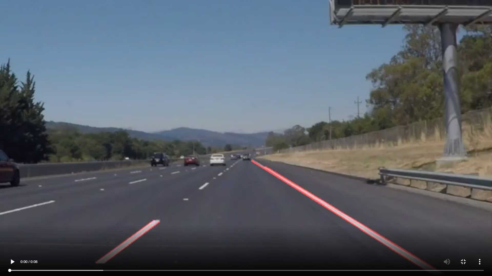
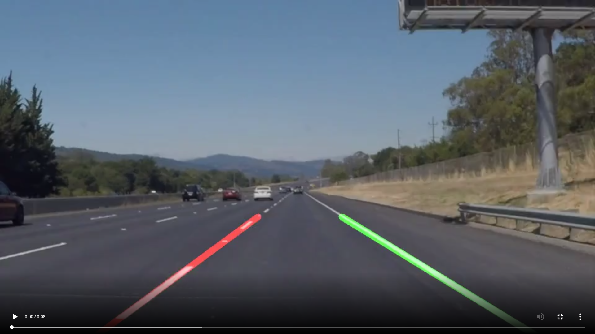

# **Finding Lane Lines on the Road** 

## Writeup Template

### You can use this file as a template for your writeup if you want to submit it as a markdown file. But feel free to use some other method and submit a pdf if you prefer.

---

**Finding Lane Lines on the Road**

The goals / steps of this project are the following:
* Make a pipeline that finds lane lines on the road
* Reflect on your work in a written report

[//]: # (Image References)

[image1]: ./examples/grayscale.jpg "Grayscale"

---

### Reflection

### 1. Describe your pipeline. As part of the description, explain how you modified the draw_lines() function.

Here were the steps to my pipeline:

1. Convert images to grayscale
2. Apply the gaussian blur filter to the grayscaled image
3. Apply the canny edge detection algorithm
4. Apply region of interest and focus the images into a triangle
5. Apply the hough lines algorithm to trace out the 2 lane lines
6. Perform a weighted_img using cv2.addWeighted to display both the lane lines and the image

What I modified for the draw lines function:

- I made my pipeline directly from the QandA linked. The video talks about getting the slope of the lines, appending them to a list and place a conditional saying that if the slope falls between 2 thresholds, append them to the list. Else, discard them
- After appending them to the list (in this case it was x1_left, x2_left, x1_right and x2_right), I then took the average of them using np.mean()
- Once I get those values, then I can directly stitch/draw them using the cv2.line function
- The reason who I have an x1_right as well is remember that we need to draw two lines, one on the left and one on the right. The line on the right will have a negative slope because it is heading "downward" vs the one on the left. That was something I did not keep in mind initially and the model failed. But now it's fixed :)

Here's what it looked like before (click on the picture):

Here's what it looks like now:

### 2. Identify potential shortcomings with your current pipeline

- If the line is something like x = 5, then the slope is undefined. This can cause NaN errors (as I would assume occured when I tested the current model in the curved lines challenge)
- Maybe the threshold values for the slopes are not optimal (0.5,1.0,-0.5,-1.0) and should be fixed. 

### 3. Suggest possible improvements to your pipeline

How I can potentially improve the pipeline:

- Think of the slope of every single point that you take as a derivative of a polynomial/higher degree function. Then, what you can do is then use those derivatives to actually stitch out the polynomial (in this case, would be curved lines) function. (The analogy of derivatives is very bad since a derivative is constant but I think it's the best way to explain it)
- Play around and look for better thresholds for the slopes/y values